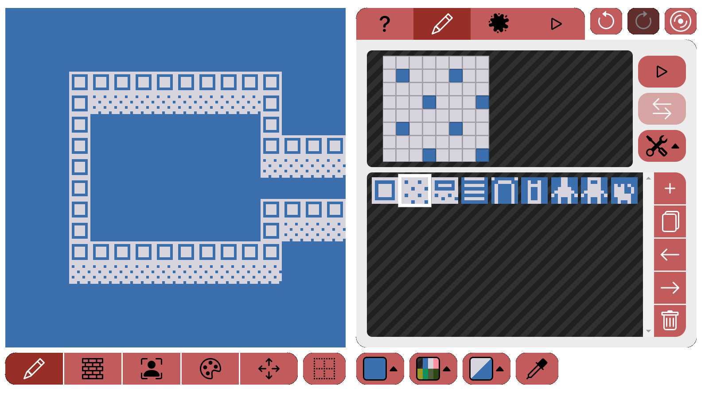
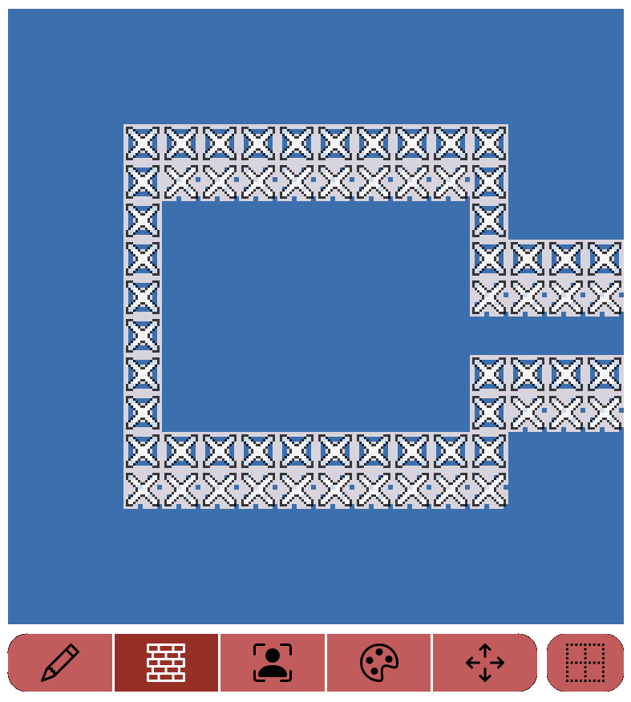
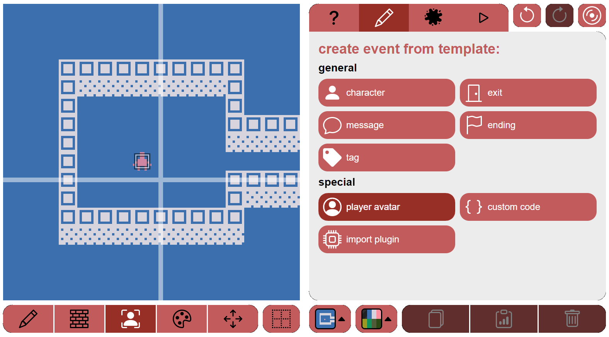
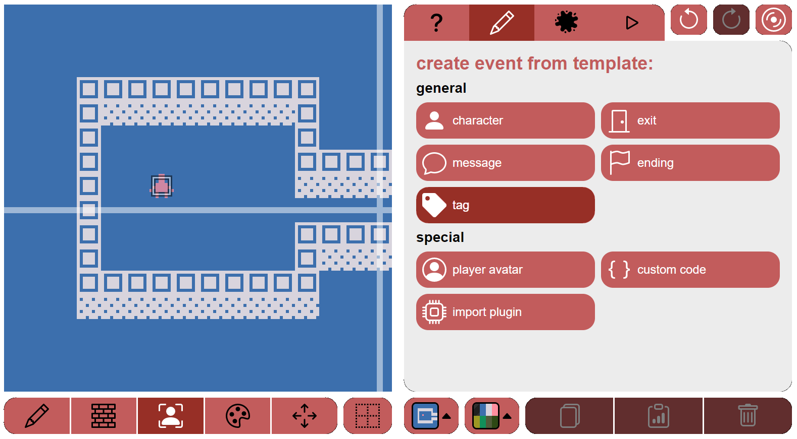
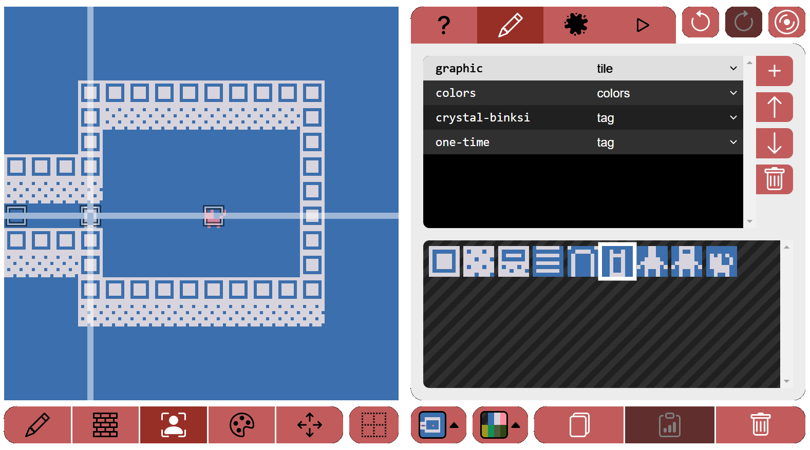
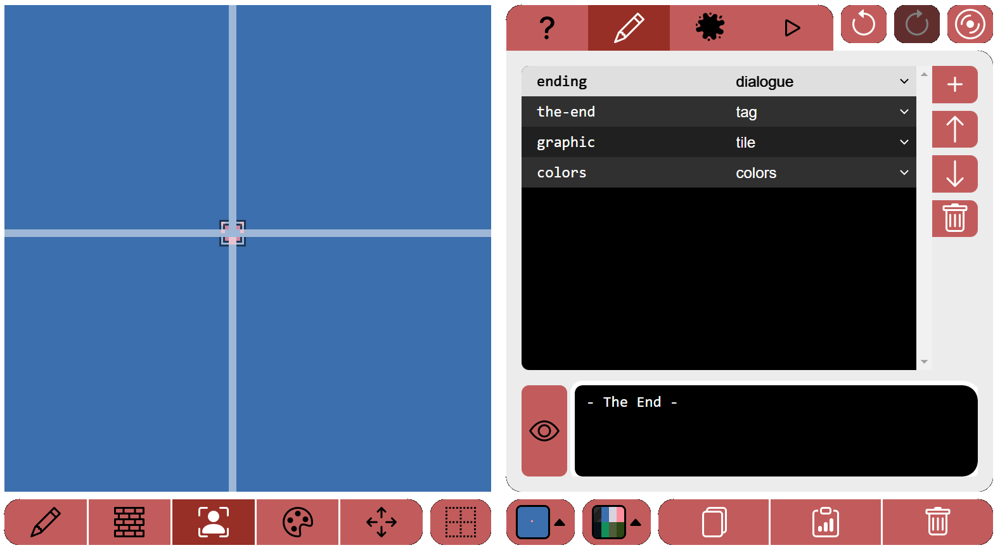

# Quick Tutorial

Here's a very quick tutorial to get you started!

Binksi works in a slightly different way than bipsi. While bipsi is self-contained, in binksi the game is comprised of two different dimensions: the world (bipsi) and the script (ink).

A good metaphor is that all the rooms, the player avatar, characters and items, are like a theatrical play. The characters and your avatar are puppets, the items are props and the rooms are different stage decorations. However, you can't have a play without a script! And this is where ink comes in: Using the ink script, you tell your little puppet avatar what it can or can't interact with, what a character says or what happens next.

This tutorial will assume a basic understanding of ink.

That said, let's get started!

## Setting up a room

Binksi comes preloaded with a demo game, but in this case we want to start afresh! Open the "switch rooms" panel (in dark blue) and press +. A new room will be created.


Navigate to the "draw tiles" mode (pencil on the bottom-left corner of the screen), select a tile from the panel and start drawing on the canvas on the left!



Once you are happy with the way the room looks, you need to set up walls so your avatar can't just walk through the walls you just drew with tiles.

Go to the "draw walls" mode (brick wall icon on the bottom-left corner of the screen) and select what tiles are not walkable!



If you want to create rooms quickly, you can also duplicate them! Instead of pressing + in the "switch rooms" panel, press the copy button.


I will use this shortcut to create a mirrored version of this first room, and then tweak the tiles and walls.

Now, you need to set up the room in ink! Navigate to `edit story` (the tab on the right panel with the splotch of ink icon).

There's many ways to go around this, but the simples method is to set up every room as a knot:
```
=== left_room
-
-> left_room

=== right_room
-
-> right_room
```

### Placing the avatar in the new room

Feel free to erase the binksi demo rooms! Open the switch rooms panel and bin them!

However, you have now deleted the player avatar! Do not fret, you can just create it again by going to the "edit events" mode (the bust picture icon under the left canvas). Select an empty space with the reticule and click on the `player avatar` button.



Place the avatar somewhere inside the room.

(Using the Player Avatar button you can respawn the avatar in a new room if you have lost it in one of your rooms and can't find it.)

### Creating an exit

Now we need an exit to go from one room to another! In bipsi you'd use an `exit` event. However, in binksi this works a bit different!

Go to the "edit events" mode, select the space where you want to place the event with the reticule and use the `tag` template.



Change the name of the tag from `tagname` to something a bit more descriptive, like `left-room-exit`.

In ink we now create an option in each room so we can interact with the exit tags, and teleport the avatar to another room:

```
=== left_room

+ [tag: left-room-exit]
    SPAWN_AT(right-room-exit)
    -> right_room

-
-> left_room


=== right_room

+ [tag: right-room-exit]
    SPAWN_AT(left-room-exit)
    -> left_room
-
-> right_room
```

As you can see, we are not only using the binksi `SPAWN_AT()` function, but you also need to divert the flow of the ink to the new room. If you forget to do this, the avatar will quite literally be unable to interact with the world, as it'll have lost the flow of the script!

## Creating a character

Next, let's create a character to interact with in the second room. Pixel the Cat.

Navigate to the second room we created, and on the "edit events" mode use the Character template.


Edit the character to your liking and make sure you change the name of the `character-tagname`/tag field to something a bit more descriptive! In this case we're doing `pixel-the-cat` even if it's a bit long.

In the ink, we're actually planning to have Pixel appear in the second room, but once we speak to him, he'll teleport to the first room - and will have something different to say!

For this I've set up a `cat-warp`/tag event in the first room.

This is what the story will look like at this stage:

```

=== left_room

+ [tag: left-room-exit]
    SPAWN_AT(right-room-exit)
    -> right_room

+ [tag: pixel-the-cat]
  Hello! I'm here now!

-
-> left_room


=== right_room

+ [tag: right-room-exit]
    SPAWN_AT(left-room-exit)
    -> left_room

+ [tag: pixel-the-cat]
  Did you enjoy your \~\~crystal binksi\~\~?
  ++ Yes
     That's great!
  ++ No
     That's too bad...
  --
 Anyway, I want to go to the other room. See ya!
 SPAWN_AT(cat-warp, pixel-the-cat)

-
-> right_room

```

As we're having Pixel warping just after you speak to him, we could technically use a normal choice `*` instead of a sticky `+` one. However, if you plan on having a character stick around, you better use a sticky choice! Otherwise the character will say the script once and then will stay there but you the avatar won't be able to interact with it anymore!

You can of course mix it up using variables! You can have a first dialogue where you're forced to make a choice. Then based on that first interaction, Pixel will say A or B if you interact with him again. It'd look like this:

```
=== right_room
...

* [tag: pixel-the-cat]
  Did you enjoy your \~\~crystal binksi\~\~?
  ++ Yes
     That's great!
     ~ liked_binksi = true
  ++ No
     That's too bad...
     ~ liked_binksi = false
  --

+ {liked_binksi} [tag: pixel-the-cat]
    I love crystal binksi too :)

+ {not liked_binksi} [tag: pixel-the-cat]
    I guess crystal binksi is too sweet...
```

However, we're not doing this in this tutorial game.

### Creating a collectible item

But what is this Crystal Binksi that Pixel keeps talking about? A collectible item!

We're placing it in the corridor on room to right room, just before we meet Pixel. In a place it's impossible we will talk to him before we pick this up.

Just in the same way we created Pixel, use the `character` template, but add a new tag field called `one-time`. This will ensure that once the item is interacted with the engine will delete it and make it disappear. 



As before, in this case you can use either a normal `*` or a sticky `+` choice. We will place it in the `right_room` knot:

```
=== right_room
...

+ [tag: crystal-binksi]
    \~\~Hmmm...\~\~ A refreshing can of crystal binksi.
```


If you want it so the avatar can't walk over the item, feel free to add a `solid`/tag field too.

## Finishing up the game

We're almost done! Now the last thing to do is to ensure the game has an end trigger! For this we are creating an event using the Ending template. This is just as it would work in bipsi: write the wrapping sentence(s) in the bipsi text editor in the `ending`/dialogue field. Once the game shows that text box the game will end.



In this case we've also added graphics and colours to the event by adding the `graphic`/tile and `colors`/colors fields. And for a nice effect, we've placed the event in a "warehouse" room that is inaccesible to the player, so we can keep it hidden from view there. We will make it so once you speak to Pixel for the first time, the ending event will teleport to the space where the avatar appear once the game starts: a tag event named `game-start`.

And thus, this is the full script for the game:

```
tutorial ==binksi== game #TITLE

-> init

=== init
+ [auto: start game]
    SPAWN_AT(game-start)
    -> left_room

=== left_room

+ [tag: left-room-exit]
    SPAWN_AT(right-room-exit)
    -> right_room

+ [tag: pixel-the-cat]
  Hello! I'm here now!

-
-> left_room


=== right_room

+ [tag: right-room-exit]
    SPAWN_AT(left-room-exit)
    -> left_room

+ [tag: crystal-binksi]
    \~\~Hmmm...\~\~ A refreshing can of crystal binksi.

+ [tag: pixel-the-cat]
  Did you enjoy your \~\~crystal binksi\~\~?
  ++ Yes
     That's great!
  ++ No
     That's too bad...
  --
 Anyway, I want to go to the other room. See ya!
 SPAWN_AT(cat-warp, pixel-the-cat)
 SPAWN_AT(game-start, the-end)

-
-> right_room
```

Congratulations! You now have a fully working binksi game!

<iframe src="./tutorial-binksi.html" frameBorder="0" width="512" height="512" style="
    margin-left: calc(50% - 256px);
"></iframe>
